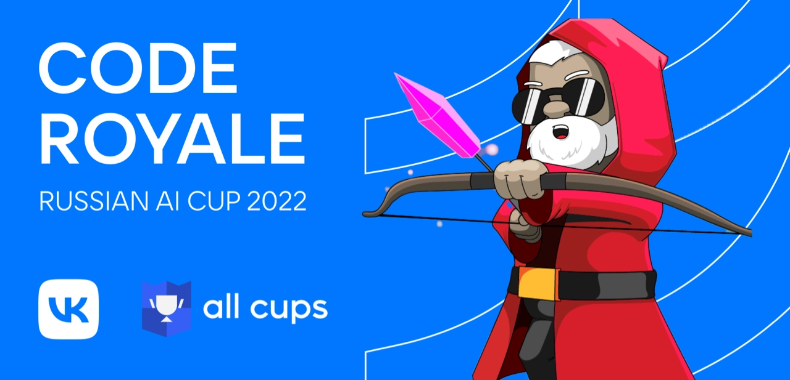

# AICup 22 - CodeRoyale

CodeRoyale championship's task is a game of battle royale genre.
Besides actual participants of the championship,
autobots whose behavior is built into the server, form teams to battle each other.

Your goal is to score more points than your opponents.
Score is given for survival, damage and kills.

Game zone is continuously shrinking, dealing damage to all units who happen to be outside.
For efficient fighting you will also have to loot weapons, ammo and shield potions, and take cover behind obstacles.

Details:

- [Game logic](game.md)
- [Differences between rounds](rounds.md)
- [Working with app for local testing](app.md)
- [Building your strategy](client.md)
- [Game API objects description](api/model.md)
- [Debug interface objects description](api/debugging.md)
- [List of game options](options.md)
