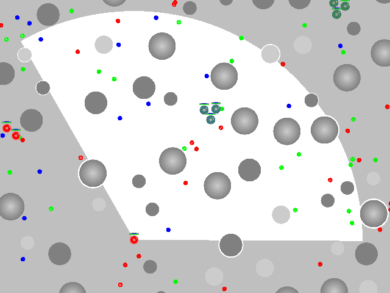
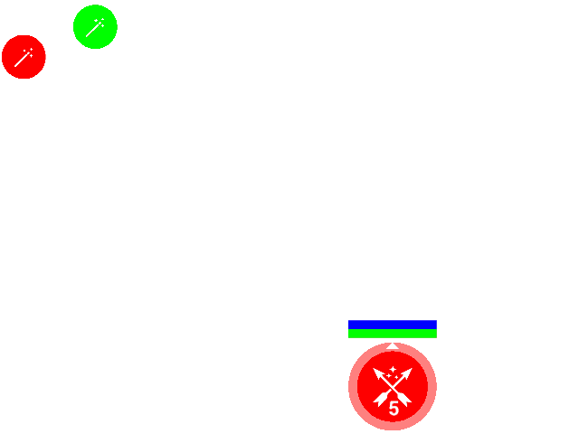
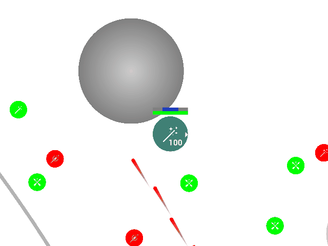
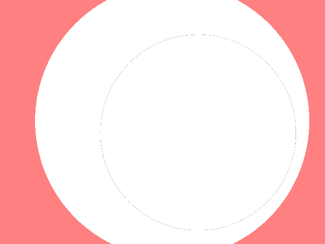
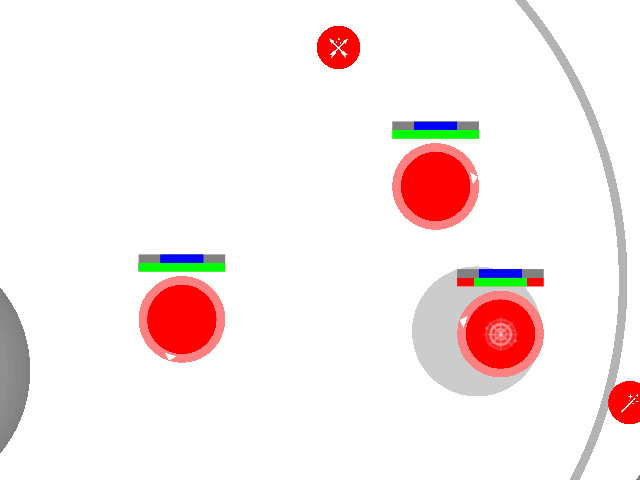
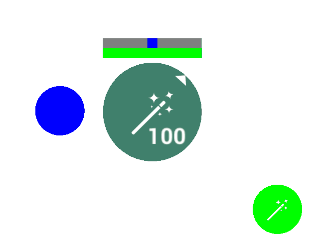

# AI Cup 22 - CodeRoyale

At the very start of the game, obstacles and loot are being randomly generated.
Game zone has radius `initial_zone_radius` and is centered at (0, 0).
Each player (team) starts in a random point inside the zone.
Multiple units of each team will be located near each other.
At first, units can only move, and will be able to shoot and perform other actions only after "full spawn" after `spawn_time` game seconds.

Each tick is processed in documented order:

- Determining visible entities
- Information is sent to your strategies (and neutral bots) and received orders
- Unit actions
- Rotation
- Shooting
- Movement
- Projectiles
- Zone
- Death and respawn
- Automatic health regeneration
- Sounds
- Applying used shield potions

## Game time

Game time is measured in seconds, although logic is split into ticks.
Each tick game time proceeds by `delta_time = 1 / ticks_per_second` seconds.

When calculating number of ticks based on time the result is rounded up: `time_to_ticks(t) = ceil(t * ticks_per_second)`.

## View

Your strategy does not get all units and loot in the game, but only a small part that is "visible" to at least one of your units.
Note, that information about all the obstacles, to the contrary, is available from the very start (`Constants::obstacles`).
Unit's view is limited:

- By `view_distance`
- By field of view. By default it is equal to `field_of_view` degrees
  (`field_of_view / 2` to the left and `field_of_view / 2` to the right of where unit is currently looking).
  When aiming, field of view is even more limited.
  When in full aim it equals to `aim_field_of_view`, specified in weapon's properties.
  When not in full aim the value is interpolated linearly.
  So, the value is actually `field_of_view - (field_of_view - aim_field_of_view) * aim` degrees
- If `view_blocking = true`, a fully spawned unit (with `remaining_spawn_time` field being absent) may not see through other units (fully spawned) and obstacles (if not specified otherwise).
  This rule does include enemy spawning usings.
  In other words, spawning units can see and can be seen through obstacles.
- Entities intersecting with the unit are always visible (for example loot under the unit)

If enemy unit or other entity is at least partially in unit's view, you will see it in the API.

## Bots

In the beginning of each tick neutral players (bots) calculate orders for their units.
Bots are not any different from real participants, other than that their behavior is built into the game logic.

## Unit actions

Units may perform actions and move at the same time.
Each action takes a certain amount of time.
While performing an action, you can not aim, shoot and perform other actions.
You can start an action if unit is fully spawned (`remaining_spawn_time` field is absent),
is not aiming (`aim = 0`),
and is not currently performing an action (`action` field is absent).
When processing actions units are processed sequentially in random order.

Available types of actions:

- Use a shield potion.

  Will be ignored if unit already has max shield value, or if inventory does not contain shield potions.

  Action lasts `shield_potion_use_time` seconds.
  **After** successfully performing the action, number of shield potions in the inventory will be reduced by one,
  and shield value will be increased by `shield_per_potion` (but may not become more than max value).

  Increasing shield value is performed in the very end - before moving on to the next tick

- Pick up an item

  May only be performed if unit is "above" the loot.
  All the loot items are considered points, so unit is "above" if distance between unit's center to the item is less than unit's radius.

  If item is a weapon and unit already has a weapon,
  current weapon will be dropped on the ground - a new item with it will spawn.

  If item is a shield potion, and unit's inventory already contains `max_shield_potions_in_inventory`, order will be ignored.
  Otherwise the inventory number will be increased by number of potions in the item.
  If after that inventory has more than max amount, leftovers will be dropped back on the ground.

  If item contains ammo, and unit's inventory already contains max amount of ammo for that weapon type (`max_inventory_ammo` in corresponding weapon's properties), order will be ignored.
  Otherwise the inventory number will be increased by the amount of ammo in the item.
  If after that inventory has more than max amount, leftovers will be dropped back on the ground.

  If successfully performed, unit will not be able to aim, shoot or perform other actions next `looting_time` seconds.
  Unit's `action` field will be setup accordingly.

- Drop an item.

  You may drop your weapon, shield potions and ammo.

  Order will be ignored if unit does not have the item in inventory.
  Also, when dropping ammo/shield potions, you may not drop more than you have (only as much as possible will be dropped).

- Aiming and shooting (described in later section)

While performing actions unit will have `action` field setup, where you can see finish tick.

When dropping items (including automatic drops on overflow),
new item is spawn in random point underneath the unit.

## Rotation

If you want unit to look in specific direction, specify it in the order (`UnitOrder.target_direction`).
Direction is specified in vector form.
If length is less than half unit's radius, no rotation will happen, otherwise length does not matter.
Rotation speed is limited, by `rotation_speed` degrees per second by default.
When aiming, speed is limited even more:
in full aim the limit equals `aim_rotation_speed`, specified in weapon's properties.
When not in full aim the limit is interpolated linearly.
This, the limit is equal to `rotation_speed - (rotation_speed - aim_rotation_speed) * aim` **degrees** per second.

## Shooting

For spawning units (with `remaining_spawn_time` field present) shooting is not processed, as well as for units without a weapon.

In order to shoot, you first need to be in full aim. To start aiming, give corresponding order.
If unit is currently performing an action (unit's `action` field is present), it is also impossible to aim.

Aiming takes a certain amount of time, and unit's `aim` field is a value from `0` to `1` indicating the progress.
When having aim order, this value is increasing at speed of `1 / aim_time` per second (`aim_time` is specified in weapon's properties).
If not having aim order, the value will be decreasing at the same speed.
Value may not be less than `0` or more than `1`.

If `aim = 1`, only then unit may actually shoot. Specify `shoot = true` in the order to do so.

If unit has ammo for the weapon in the inventory, a shot is made.
Amount of ammo is decreased by `1`.
Next shot can only be made on `next_shot_tick = current_tick + time_to_ticks(1 / rounds_per_second)`.
A `Projectile` entity is being added to the game.
Also, if `shot_sound_type_index` is listed in weapon properties, a new sound source will be added at the same position.

Direction of the projectile's velocity will be rotated by a random angle (with uniform distribution) from `-spread / 2` up to `spread / 2` degrees.
Position of the projectile will be at the unit's border.
Projectile speed will be equal to `projectile_speed` specified in weapon's properties.

## Movement

Units' movement during one tick is processed sequentially in random order.

When moving a single unit all other units are considered to be static.

First, target velocity is calculated. If all restrictions are considered, it may be equal to the one specified in the order.
If unit is spawning, the length is limited by `spawn_movement_speed`.
Otherwise there are separare limits for moving forward and backward.
By default forward speed is limited by `max_unit_forward_speed`, and backward speed is limited by `max_unit_backward_speed`.
Additional limits are in place when aiming:
when in full aim limits are multiplied by `aim_movement_speed_modifier` specified in weapon's properties.
When not in full aim modifier is linearly interpolated.
So, forward movement speed is limited by `max_unit_forward_speed = max_unit_forward_speed * (1 - (1 - aim_movement_speed_modifier) * aim)`, and backward speed is limited by `max_unit_backward_speed = max_unit_backward_speed * (1 - (1 - aim_movement_speed_modifier) * aim)`.
After calculated forward/backward limits, the vector of target velocity is limited with a circle of radius `(max_unit_forward_speed + max_unit_backward_speed) / 2`.
The center of the circle is located in unit's view direction in distance of `(max_unit_forward_speed - max_unit_backward_speed) / 2`.
When applying limits, the direction of the target velocity is preserved.

After calculating target velocity unit's velocity is updated:
it is moved toward the target, but the difference on one tick is limited by `unit_acceleration * delta_time`.

If unit is spawning, it may intersect with any game entities.
Otherwise collision detection is happening.
Movement is performed continiously until first collision with another unit (fully spawned), or an obstacle.
Upon collision velocity is zeroed alongside normal, thus movement continues along tangent.
After this, movement continues either until the end of tick, or until next collision.
So, there may be at most two collisions per tick.
Such mechanic allows for automatic going around the obstacles.

If unit is spawning, `remaining_spawn_time` is reduced by `delta_time`, but it can't become less than zero.
If it reached zero, a check happens whether unit intersects with other entities.
If it does, unit takes health damage of `spawn_collision_damage_per_second * delta_time`, and unit is continuing the spawning process.
Damage does not go to the shield. Health regeneration is delayed.
In case of no intersections, unit becomes fully spawned.
So, unit may only spawn on empty space.

If `steps_sound_type_index` is set, and unit is fully spawned, a sound source may be created in the new unit position.
The probability is equal to `min(travel_distance / steps_sound_travel_distance, 1)`.

Next unit's movement will be processed after fully processing previous one.

## Projectiles

Projectiles are modeled as points (circles with zero radius).

Projectiles are processed sequentially in random order.

Projectiles move with constant speed.
Projectiles move until collision with unit or obstacle (some obstacles may still be shot through),
or until their lifetime reaches zero (initially equal to `projectile_life_time` seconds).
Collision with spawning units is ignored.

When calculating collision of projectile with a unit, unit is considered to be moving with constant speed from the position at the beginning of the tick to the position at the end of the tick (calculated in "Movement" step).

When projectile has collided, is is deleted from the game world.

When colliding, if `projectile_hit_sound_type_index` is set in weapon properties, a new source sound is created at collision point.

If colliding with enemy unit, or `friendly_fire = true`,
unit is damaged by `projectile_damage` specified in weapon properties.
First, damage is dealt to unit's shield. In case damage is more than shield value, unit's health is also damaged.
If unit's health was damaged, health regeneration is delayed.
If only unit's shield was damaged, health regeneration may continue.

If unit was an enemy, player who made the shot is remembered for it.
Upon unit's death last player that dealt damage to it is considered as the one who killed it.
Damaging and killing enemy units give score necessary for winning.

Damaging and killing friendly units do not give score.

## Zone

Game area is limited with a circular "zone".
All units at least partially located outside the zone are taking `zone_damage_per_second` damage to health per second.
Shield is not damaged. Health regeneration is delayed.

Zone is constantly shrinking - its radius is changing at `zone_speed` per second.
Center of the zone is moving toward `next_center` with constant speed in such way that it will become same as `next_center` when radius reaches `next_radius`.
At that point next center and radius will be calculated:
Radius (`next_radius`) will be equal to half of the current radius, and center (`next_center`) will be chosen as random point inside the circle centered at `current_center` and radius of `next_radius` (already halved).

When calculating damage zone's state at the beginning of the tick is used.

## Death and respawning

Units that have health less than or equal to zero are considered dead.

Upon death units drop their entire inventory on the ground:

- An item with all the shield potions, if any
- For each weapon type, an item with all the ammo, if any
- An item with unit's weapon, if any

All new items are spawned in random point inside the unit.

All the units initially have `extra_lives` extra lives.
If current zone radius is less than or equal to `last_respawn_zone_radius`, extra lives are zeroed.
If unit still has extra lives, it immediately respawns.
If there are other alive units in the player's team,
unit is respawned in the average position of all alive units.
Otherwise, unit is spawned in random point inside current zone.

Just like in the beginning of the game, unit will only become fully spawned after `spawn_time` seconds.

If no extra lives, unit is deleted from the game world forever.

## Automatic health regeneration

Units restore health automatically, but only if they didn't receive any health damage in a certain time period.
When taking health damage, unit's `health_regeneration_start_tick` field is set to `current_tick + time_to_ticks(health_regeneration_delay)` -
unit will be able to regenerate again after `health_regeneration_delay` seconds.

Health is restored at `health_regeneration_per_second` points per second.

## Sounds

Sound sources added in previous steps may be heard by your units.
You will not be able to hear sounds made by yourself.
Sound distance is limited, and the further away sound source is from you, the more imprecise location you get.
Single sound source may be heard by multiple units, in which case you will see multiple sounds in the API.

Each sound type has its own properties:

- `distance` - max distance for your unit to be able to hear it

- Precision multiplier (`offset`) - source source will actually be heard as a random point inside a circle with center at sound source location, and radius equal to the distance to the source multiplied by this multiplier.

  If after offsetting distance has become for than max, you will also not hear this sound source.

## Game results

By default game is finished when there is zero participant teams alive.
Neutral bot teams are not considered.

You may also specify `continue_until = "OneSurvivor"` to consider bot players same as participants and stop when one team is alive,
or `continue_until = "AllDead"`, to not end the game while at least one unit is alive.

Your goal is to score as much points as possible.
Score is given for:

- Killing enemy units - `kill_score` points for each
- Damaging enemy units - `damage_score_multiplier` for each point of damage dealt
- Surviving - `score_per_place` for each team eliminated before you.
  If multiple teams are eliminated at the same tick, all get equal number of survival points.
