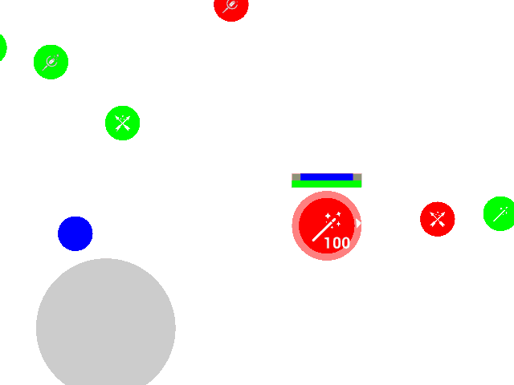
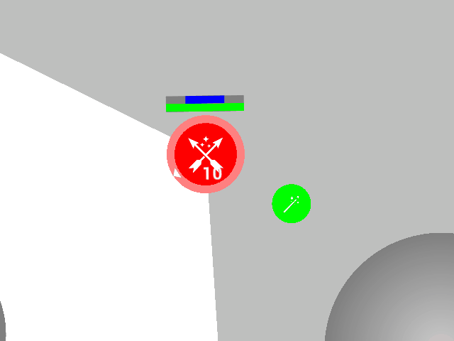
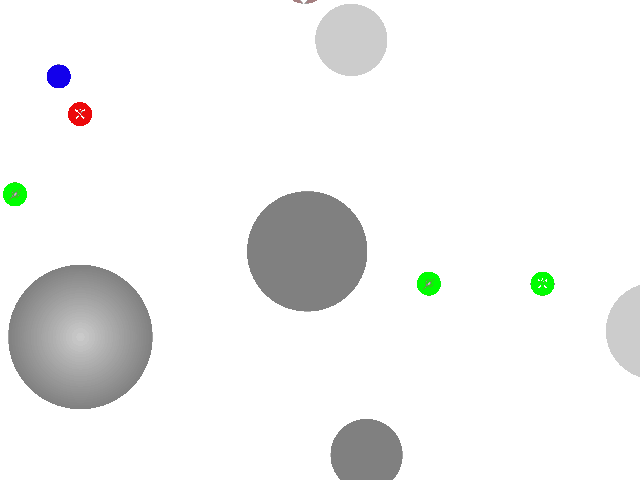
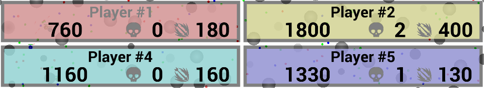

# AI Cup 22 - CodeRoyale

В начале игры случайным образом генерируются препятствия и лут.
Игровая зона имеет радиус `initial_zone_radius` и центр в точке (0, 0).
Каждый игрок (команда) появляется в случайной точке внутри зоны.
Если юнитов несколько, они будут расположены рядом друг с другом.
Вначале юниты могут лишь перемещаться.
Стрелять и выполнять другие действия они смогут только после "полного появления"
через `spawn_time` игровых секунд.

Обсчет каждого тика происходит в изложенном далее порядке:

- Определяются видимые сущности
- Информация отсылается вашим стратегиям (и нейтральным ботам), и получает от них приказы
- Действия юнитов
- Вращение
- Стрельба
- Движение
- Снаряды
- Зона
- Смерть и возрождение
- Автоматическая регенерация здоровья
- Звуки
- Применение выпитых зелий щита

## Время

Время в игре считается в секундах, несмотря на то что моделирование поделено на тики.
За один тик игровое время продвигается на `delta_time = 1 / ticks_per_second` секунд.

При расчете количества тиков исходя из времени происходит округление вверх: `time_to_ticks(t) = ceil(t * ticks_per_second)`.

## Зрение

Вашей стратегии на вход подаются не все юниты и лут, находящиеся в игре, а только те, которых "видит" хотя бы один из ваших юнитов.
При этом информация о всех препятствиях доступна с самого начала игры (`Constants::obstacles`).
Поле зрения юнита ограничено:

- Расстоянием `view_distance`
- Углом обзора. По умолчанию угол обзора равен `field_of_view` градусов
  (`field_of_view / 2` градусов слева от направления зрения и `field_of_view / 2` градусов справа).
  При прицеливании, угол обзора ограничен еще больше.
  При полном входе в прицел ограничение равно `aim_field_of_view`, указанному в свойствах оружия.
  При неполном входе в прицел ограничение линейно интерполируется.
  Таким образом, ограничение равно `field_of_view - (field_of_view - aim_field_of_view) * aim` градусов
- Если `view_blocking = true`, полностью появившийся юнит (отсутствует поле `remaining_spawn_time`) не может видеть насквозь других юнитов (полностью появившихся) и препятствий (если не указано иначе).
  Это правило не распространяется на вражеских появляющихся юнитов.
  Другими словами, появляющиеся юниты могут видеть и могут быть видны сквозь препятствия.
- Сущности, пересекающиеся с юнитом, также считаются видимыми (например лут под юнитом)

Если вражеский юнит или предмет хотя бы частично находится в поле зрения, вы его увидите в API.

## Боты

В начале тика нейтральные игроки (боты) рассчитывают приказы своим юнитам.
Боты ничем не отличаются от настоящих участников игры, кроме того, что их поведение встроено в игровую механику.

## Действия юнитов

Юниты могут выполнять специальные действия одновременно с передвижением.
Для каждого действия требуется определенное время.
Во время выполнения действия нельзя целиться, стрелять и выполнять другие действия.
Начать действие можно в случае, если юнит полностью появился (отсутствует поле `remaining_spawn_time` у юнита),
не находится в прицеле (`aim = 0`),
и не выполняет действие (отсутствует поле `action` у юнита).
При обработке действий юниты обрабатываются последовательно в случайном порядке.

Доступны следующие типы действий:

- Использовать зелье щита.

  Действие будет проигнорировано, если у юнита уже максимальное значение щита, либо в случае отсутствия зелий в инвентаре.

  Действие длится `shield_potion_use_time` секунд.
  **После** успешного выполнения действия количество зелий в инвентаре уменьшится на единицу,
  а щит увеличится на `shield_per_potion` единиц (при этом не сможет стать больше максимального значения).

  Увеличение щита происходит в самом конце - после перехода к следующему тику.

- Подобрать предмет

  Взаимодействие с предметом произойдет только в случае, если юнит находится над предметом.
  Предметы считаются точками, то есть юнит находится над предметом если расстояние от центра юнита до предмета меньше чем радиус юнита.

  Если предмет является оружием, и при этом у юнита уже есть оружие,
  текущее оружие будет выкинуто на землю - появится новый предмет с текущим оружием.

  Если предмет является зельями щита, и при этом в инвентаре юнита уже есть максимальное количество зелий (`max_shield_potions_in_inventory`),
  действие будет проигнорировано.
  Иначе количество зелий в инвентаре будет увеличено на количество зелий в предмете.
  Если после этого количество зелий оказалось больше максимального, остатки будут выброшены обратно на землю.

  Если предмет является патронами, действие будет проигнорировано,
  если в инвентаре есть уже максимальное количество патронов данного типа
  (`max_inventory_ammo` в свойствах соответствующего оружия).
  В противном случае количество патронов в инвентаре будет увеличено на подобранное.
  Если после этого количество патронов оказалось больше максимального,
  остатки будут выброшены обратно на землю.

  При успешном подборе предмета у юнита будет установлено поле `action`.
  В течение следующих `looting_time` секунд юнит не сможет целиться, стрелять и выполнять другие действия.

- Сбросить предмет.

  Сбрасывать можно оружие, зелья щита и патроны.

  Действие будет проигнорировано, если у юнита отсутствует предмет в инвентаре.
  Также, при сбрасывании патронов/зелий щита, нельзя сбросить больше чем находится в инвентаре (сбросится максимально возможное количество).

- Прицеливание и стрельба (описано позже)

Во время выполнения действий у юнита будет установлено поле `action`, в котором будет указан тик, в который действие будет закончено.

При выбрасывании предметов (в том числе автоматическое выкидывание оружия при подборе нового и выбрасывание лишних патронов),
предмет появляется в случайной точке под юнитом.

## Вращение

Для того, чтобы юнит изменил направление зрения, нужно указать желаемое направление в приказе (`UnitOrder.target_direction`).
Направление указывается в виде вектора.
Если длина указанного вектора направления меньше половины радиуса юнита, вращения не происходит, иначе длина не имеет значения.
Скорость изменения угла зрения по умолчанию ограничена `rotation_speed` градусов в секунду.
При прицеливании, скорость изменения угла ограничена еще больше:
при полном входе в прицел ограничение равно `aim_rotation_speed`, указанному в свойствах оружия.
При неполном входе в прицел ограничение линейно интерполируется.
Таким образом, ограничение равно `rotation_speed - (rotation_speed - aim_rotation_speed) * aim` градусов в секунду.

## Стрельба

Для появляющихся юнитов (если у юнита присутствует поле `remaining_spawn_time`) стрельба не обсчитывается, также как и для юнитов, не имеющих оружия.

Для стрельбы необходимо сначала войти в прицел. Чтобы юнит целился, нужно отдать соответствующий приказ.
При этом, если юнит занят выполнением действия (установлено поле `action` у юнита),
считается, что приказа целиться нет.

Вход в прицел происходит не мгновенно: для этого у юнита есть поле `aim`, являющееся значением от `0` до `1`.
При приказе целиться, это значение увеличивается со скоростью `1 / aim_time` в секунду (значение `aim_time` указано в свойствах оружия).
Если нет приказа целиться, значение уменьшается с той же скоростью.
При этом значение не может стать меньше `0` или больше `1`.

Если значение `aim` равно `1`, юнит может произвести выстрел. Для этого нужно указать `shoot = true` в приказе.

Если в инвентаре есть патроны для текущего оружия юнита, выстрел производится.
Количество патронов уменьшается на `1`.
Следующий выстрел можно будет произвести только `next_shot_tick = current_tick + time_to_ticks(1 / rounds_per_second)`.
В игру добавится объект снаряда (`Projectile`).
Также, если установлен `shot_sound_type_index` в свойствах оружия, будет добавлен источник звука с данным типом в той же позиции.
Будет считаться, что звук произведен тем игроком, чей юнит произвел выстрел.

Направление снаряда будет отклонено от направления зрения юнита на случайный угол (с равномерным распределением) от `-spread / 2` до `spread / 2` градусов.
Позиция снаряда будет находится на границе юнита - в направлении полета из центра юнита.
Скорость снаряда будет равна `projectile_speed`, указанной в свойствах оружия.

## Движение

Перемещение юнитов в рамках одного тика происходит поочередно в случайном порядке.

При перемещении одного юнита все остальные считаются статичными.

Вначале рассчитывается целевая скорость. Она может быть равна скорости, указанной в приказе, если соблюдены следующие ограничения.
Если юнит в процессе появления, длина целевой скорости ограничена `spawn_movement_speed`.
В противном случае существуют отдельные ограничения на скорость движения вперед и назад.
По умолчанию скорость движения вперед ограничена `max_unit_forward_speed`, а скорость движения назад `max_unit_backward_speed`.
Дополнительное ограничение возникает при прицеливании:
при полном входе в прицел ограничения умножаются на коэффициент `aim_movement_speed_modifier`, указанный в свойствах оружия.
При неполном входе в прицел коэффициент линейно интерполируется между `1` и заданным.
Таким образом, скорость движения вперед ограничена `max_unit_forward_speed = max_unit_forward_speed * (1 - (1 - aim_movement_speed_modifier) * aim)`, а скорость движения назад `max_unit_backward_speed = max_unit_backward_speed * (1 - (1 - aim_movement_speed_modifier) * aim)`.
После расчета ограничений вперед/назад, вектор целевой скорости ограничивается кругом радиуса `(max_unit_forward_speed + max_unit_backward_speed) / 2`.
Центр круга ограничения скорости лежит по направлению зрения юнита на расстоянии `(max_unit_forward_speed - max_unit_backward_speed) / 2`.
При применении ограничений на целевую скорость, указанную в приказе, направление сохраняется.

После расчета целевой скорости происходит обновление вектора скорости юнита:
скорость стремится к целевой скорости, однако изменение за один тик ограничено `unit_acceleration * delta_time`.

Если юнит в процессе появления, он может пересекаться с любыми сущностями в игре. В противном случае происходит проверка столкновений.
Движение происходит непрерывно, до первого столкновения с другим юнитом (полностью появившимися) или препятствием.
При столкновении обнуляется проекция скорости юнита на нормаль, то есть продолжаться движение будет по касательной.
После этого движение продолжается либо до конца тика, либо до следующего столкновения.
Таким образом может произойти максимум два столкновения за тик.
Данная механика позволяет автоматически обходить препятствия.

Если юнит в процессе появления, время появления (`remaining_spawn_time`) сокращается на время тика (`delta_time`).
При этом время не может стать меньше нуля.
Если время стало равно нулю, проверяется наличие пересечения юнита с другими юнитами (полностью появившимися) и препятствиями.
При наличии пересечений, юнит получает урон по здоровью `spawn_collision_damage_per_second * delta_time`, и юнит продолжает "появление".
По броне урон не проходит. При этом регенерация здоровья юнита приостанавливается.
При отсутствии пересечений, юнит считается полностью появившимся.
Таким образом, появление возможно только на пустом месте.

Если установлен `steps_sound_type_index`, а также юнит полностью появился, может быть создан источник звука в новой позиции юнита.
Вероятность звука равна `min(travel_distance / steps_sound_travel_distance, 1)`.
Будет считаться, что звук произведен игроком, которому принадлежит юнит.

Обработка следующего юнита происходит после полной обработки движения предыдущего.

## Снаряды

Снаряды считаются точками (кругами с радиусом `0`).

Обработка снарядов происходит последовательно в случайном порядке.

Снаряды движутся с постоянной скоростью.
Снаряды летят до тех пор, пока не столкнутся с юнитом или препятствием (некоторые препятствия могут быть простреливаемыми, с ними столкновения игнорируются),
либо пока не закончится их время жизни (изначально равное `projectile_life_time` секунд)
Столкновения с появляющимися юнитами игнорируются.

При расчете столкновения снаряда с юнитами, считается что юнит двигался с постоянной скоростью из положения на момент начала тика, до положения на момент конца тика (посчитанном в шаге "Движение").

При столкновении снаряда с юнитом или препятствием, он удаляется из игрового мира.

При столкновении, при наличии `projectile_hit_sound_type_index` в свойствах оружия,
добавляется источник звука заданного типа в точке попадания.
Будет считаться, что звук произведен тем игроком, чей юнит выстрелил данный снаряд.

Если столкновение произошло с вражеским юнитом, либо `friendly_fire = true`,
юниту наносится урон (`projectile_damage`), указанный в свойствах оружия.
При этом в первую очередь урон наносится по броне.
В случае, если урон больше значения брони юнита, по здоровью.
Также, если прошел урон по здоровью, регенерация здоровья юнита приостанавливается.
Если урон прошел только по броне, регенерация может продолжаться.

Если юнит является вражеским, для юнита запоминается игрок, чей снаряд нанес урон.
При смерти юнита считается что его ликвидировал тот игрок, который последний нанес ему урон.
За урон и ликвидацию юнитов даются игровые очки, необходимые для победы.

За урон и ликвидацию своих юнитов очки не даются.

## Зона

Игровая область ограничена круговой "зоной".
Всем юнитам, которые хотя бы частично находятся за пределами зоны,
наносится урон здоровью `zone_damage_per_second` в секунду.
По броне урон не проходит. При этом регенерация здоровья юнита приостанавливается.

Зона постоянно сужается, то есть ее радиус изменяется, со скоростью `zone_speed`.
При этом центр зоны смещается в сторону `next_center` с постоянной скоростью таким образом, чтобы на момент, когда радиус станет равным `next_radius`, центр был равен `next_center`.
В этот момент будет определен следующий центр и радиус следующим образом.
Радиус (`next_radius`) будет равен половине текущего, центр (`next_center`) выберется случайным образом в кругу с центром в `current_center` и радиусом `next_radius` (уже поделенном пополам).

При расчете нанесения урона юнитам используется состояние зоны на момент начала тика.

## Смерть и возрождение

Юниты, чье здоровье оказалось меньше либо равно нуля, считаются мертвыми.

При смерти юниты выбрасывают полностью свой инвентарь в качестве лута на землю, а именно:

- Появится предмет с зельями щита, если у юнита они были
- Для каждого типа оружия, если в инвентаре были патроны, появится соответствующий предмет
- Если у юнита было оружие, также появится предмет

Все новые предметы появятся в случайной точке внутри юнита.

При этом у всех юнитов изначально есть дополнительные `extra_lives` жизней.
Если радиус текущей зоны стал меньше либо равен `last_respawn_zone_radius`, то дополнительные жизни обнуляются.
Если дополнительные жизни юнита не закончились, он сразу воскрешается.
Если в команде у игрока, контролирующего юнит, есть еще живые юниты,
данный юнит появляется в позиции равной средней позиции всех живых юнитов игрока.
Если живых игроков нет, юнит появляется в случайной позиции внутри текущей зоны.

Также, как и в начале игры, юнит полностью появится только через `spawn_time` секунд.

Если дополнительные жизни закончились, юнит навсегда удаляется из игрового мира.

## Автоматическая регенерация здоровья

Юниты автоматически регенерируют здоровье, но только в случае если они не получали урон по здоровью в последнее время.
При получении урона по здоровью,
у юнита устанавливается поле `health_regeneration_start_tick = current_tick + time_to_ticks(health_regeneration_delay)` -
юнит сможет регенерировать здоровье только через `health_regeneration_delay` секунд.

Здоровье регенерируется со скоростью `health_regeneration_per_second` единиц в секунду.

## Звуки

Источники звука могут быть услышаны вашими юнитами.
При этом вы не будете слышать звуки, произведенные вашим игроком.
Дальность звука ограничена, причем чем дальше юнит от источника звука, тем более неточные данные вы получите.
Один источник может быть услышан несколькими вашими юнитами, в этом случае вы увидите более одного звука в API.

Для каждого из типов звуков есть свои настройки:

- Дальность (`distance`) - максимальное расстояние, на котором вы услышите звук.
  Если расстояние между юнитом и источником больше, вы не услышите звук

- Коэффициент погрешности (`offset`) - источник звука будет слышен из случайной точки в кругу
  с центром, совпадающим с настоящим источником звука,
  и радиусом, равным расстоянию между вашим юнитом и источником, умноженному на данный коэффициент.

  Если после смещения расстояние стало больше максимального, вы также не услышите этот звук.

## Результаты игры

По умолчанию игра заканчивается когда в живых остается ноль команд участников.
При этом не учитываются команды нейтральных ботов.

Также, в настройках можно указать `continue_until = "OneSurvivor"`, чтобы нейтральные команды учитывались,
либо `continue_until = "AllDead"`, чтобы игра не заканчивалась, пока в игре жив хотя бы один юнит.

Цель вашей стратегии в игре - набрать как можно больше очков.
Очки начисляются за:

- Ликвидации вражеских юнитов - за каждое по `kill_score`
- Урон - `damage_score_multiplier` за каждую единицу нанесенного урона
- Выживание - `score_per_place` за каждую команду, которая выбыла до вас.
  Если две команды выбыли из игры в один и тот же тик, они получат одинаковое количество очков за выживание.
